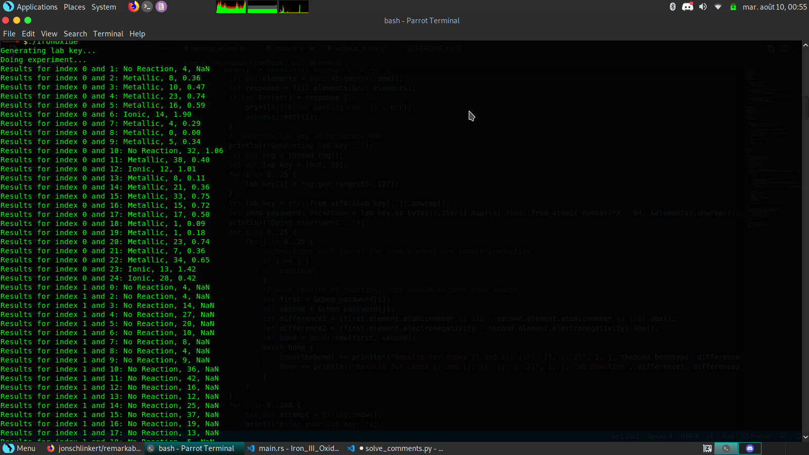
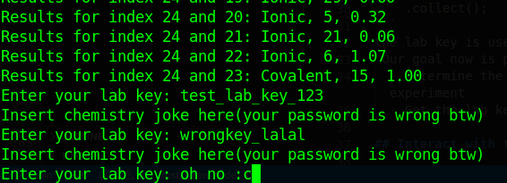
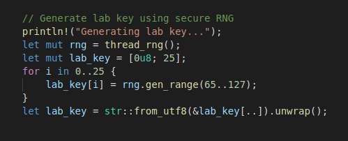
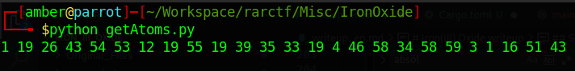

# Iron(III) Oxide writeup

## Understanding the program

The application itself is pretty simple.
When it's launched, it will print the result of the experiment.




The experiment is pretty simple, it will choose 25 atoms and will print out the bonds between them.

It will then ask you the lab_key, 



if you submit the good lab_key, you get a flag.

Now let's take a look at the code!

I instantly look at the `print_flag()` function, but it's only called once, 
and it's only when you submit the good lab key

so i continue my way up the code, and take a look at the lab_key
it's a string of 25 random printable characters generated randomly, using a secure generator.



Continuing my tour of the code, i see that the labkey is used once

it's used to generate the "chem_password" which is the list of atoms used in the experiment !
```rust
let chem_password: Vec<Atom> = lab_key
    .as_bytes()
    .iter()
    .map(|x| Atom::from_atomic_number(*x - 64, &elements).unwrap())
    .collect();
```

Meaning that if we manage to reverse the experiment, get the atoms from their bonds, we have the chem_password and the lab_key !


## Interact with the program

First and foremost, we need a way to interact with the program.
I naturally chose the exact opposite of rust, python 

I created a simple script with python, to interact with the program and scrape the resuts of the experiment

I used pwnlib tubes to interact with the program and rarctf's server.

The wrote two quick loops to get the relevant data from the experiment:
```python
from pwnlib.tubes import *

debug = True

path = "/home/amber/Workspace/rarctf/Misc/IronOxide/"
exe = "IronOxide"

#p = remote.remote("193.57.159.27", 50607)
p = process.process(executable=path+exe, cwd=path, argv="")

p.recvline()    # Generating lab key...
p.recvline()    # Doing experiment...

bonds = []
for i in range(0, 25):
    bonds.append([])
    for j in range(0, 24):
        l = p.recvline().decode()[:-1]
        # Get the three last fields separated by a comma
        bonds_data = l.split(":")[1][1:].split(',')[-3:]

        # Remove the leading space 
        bonds_data = [x[1:] for x in bonds_data]

        # Add it to an array
        bonds[i].append(bonds_data)
```

## Get a bond dictionnary

Now that we have a way to interact with the program and get the experiment's result,
we need a way to determine which atom was used from the result of the experiment 

For that, we will need a bond dictionnary, in which i will look up each bond to guess the atoms

The results only contain four pieces of data : 
 - which unknown atom interacted with which 
 - the type of bond
 - the absolute difference between their atomic number
 - the absolute difference between their electronegativity

So that's what we'll need

I quickly wrote some code i added to the program to generate a json file containing all the possible bonds and added it in the main function, just before the loop where it asks for a key. 

> Once again, terrible code
>
> But it's my first time with rust, so i guess i have an excuse


```rust
     use std::collections::HashMap;
    use serde::Serialize;
    use arrayvec::ArrayString;

    let atomvec: Vec<Atom> = elements.iter().map(|e| Atom::from_element(&e)).collect();
    let mut genbonds = HashMap::new();

    #[derive(Serialize)]
    struct s_Bond {
        BondType: ArrayString<16>,
        Diff1: i16,
        Diff2: ArrayString<8>,
    }
    for i in 0..103 {
        let a = &atomvec[i];
        let mut abonds = HashMap::new();
        for j in 0..103 {
            if i == j {
                continue;
            }
            let first = &a;
            let second = &atomvec[j];
            let difference1 =
                (first.element.atomicnumber as i16 - second.element.atomicnumber as i16).abs();
            let difference2 =
                (first.element.electronegativity - second.element.electronegativity).abs();
            let bond = Bond::new(first, second);
            let mut s = ArrayString::<16>::new();
            match bond {
                Some(thebond) => {
                    s.push_str(&format!("{:?}", thebond.bondtype));
                }
                None => {
                    s.push_str("No Reaction");
                }
            }
            let mut d = ArrayString::<8>::new();
            d.push_str(&format!("{:.2}", difference2));
            let l = s_Bond {
                BondType: s,
                Diff1: difference1,
                Diff2: d,
            };
            abonds.insert(second.element.atomicnumber, l);
        }
        genbond.insert(a.element.atomicnumber, abonds);
    }
    let serialized = serde_json::to_string(&genbond).unwrap();
    ::serde_json::to_writer(&File::create("data.json")?, &serialized)?;
```
Add this to cargo.toml
```toml
serde_json = "0.8"
arrayvec = {version = "0.7", features = ["serde"]}
```
This big piece of code is quite big, but it's mostly the code of the experiment, copy and pasted, but rather than printing the results in stdout, i store that in a structure that i will serialize in a json file

The generated json is quite dirty, i guess i could code it better, but it's easier to clean a file than to clean my code

after a bit a cleaning up, we now have a dictionnary following the structure : 
```json
{
	"1": {
		"2": {
			"LinkType": "No Reaction",
			"Diff1": 1,
			"Diff2": "NaN"
		},
		"3": {
			"LinkType": "Metallic",
			"Diff1": 2,
			"Diff2": "1.22"
		},
		"4": {
			"LinkType": "Metallic",
			"Diff1": 3,
			"Diff2": "0.63"
		},
```
each key is the atomic number of the atom

so `dictionnary["2"]["34"]` is the bond between Helium and Selenium

## Searching through this dictionnary

i quickly throw together a simple script allowing us to sift easily through this huge mess of a json file :
```python
import json
from collections import Counter

path = "/home/amber/Workspace/rarctf/Misc/IronOxide/"
jsonpath = "bonds.json"
test = [['Metallic', '1', '0.02'], ['Metallic', '19', '0.10'], ['Metallic', '37', '0.24'], ['Metallic', '39', '0.30'], ['Metallic', '54', '0.45'], ['Metallic', '45', '0.49'], ['Metallic', '28', '0.53'], ['Metallic', '28', '0.53'], ['Metallic', '28', '0.53'], ['Metallic', '10', '0.57'], ['Metallic', '27', '0.69'], ['Metallic', '29', '0.78'], ['Metallic', '44', '0.78'], ['Metallic', '11', '0.81'], ['Metallic', '6', '0.98'], ['Metallic', '6', '0.98'], ['Metallic', '16', '1.04'], ['Ionic', '43', '1.07'], ['Ionic', '43', '1.07'], ['Metallic', '12', '1.08'], ['Metallic', '57', '1.08'], ['Metallic', '13', '1.16'], ['No Reaction', '22', '1.88'], ['No Reaction', '22', '1.88']]

jsonfile = open(path+jsonpath, 'r')
bondDict = json.load(jsonfile)

def getAtom(bonds, dict):
    results = []
    for b in bonds:
        for anumber, abonds in bondDict.items():
            for bnumber, data in abonds.items():
                if  b[0] == data['LinkType'] and \
                    b[1] == str(data['Diff1']) and \
                    b[2] == data['Diff2']:
                    results.append(anumber)
    return Counter(results).most_common(1)[0][0]

print(getAtom(test, bondDict))
```

Just add this function to the first script, run it again with all the links from the experiment, and we have the chem password !!



Good ! We have all the atomic numbers of atoms, in the order in which they're in the experiment !
But we need to get the lab key from that 

## The lab key 

we know the chem_password is the bytes of the lab key, minus 64
we should be able to get the labkey by adding 64 to it, then getting the character using chr

```python
# generate the lab key

lab_key = ''
for b in bonds:
    atomicnumber = int(bondSearch(b, bondDict))
    lab_key = lab_key+chr(atomicnumber+64)

print('lab_key = ', lab_key)
```

We just have to send it with `p.sendline(lab_key.encode())`
and we get the flag as a response! 

